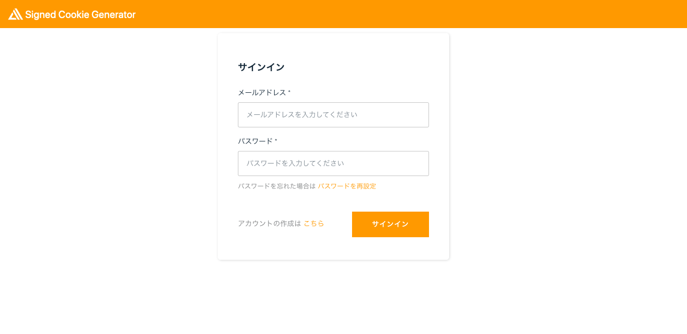

English / [**日本語**](README_JP.md)

# cloudfront-signed-cookie-generator

 

``cloudfront-signed-cookie-generator`` is an AWS Amplify application that generates signed cookies to access websites on Amazon CloudFront. The application is written in Vue.js and uses Amazon API Gateway, Amazon Cognito, AWS Lambda and AWS Secret Manager as well as the Amplify CLI.



## Architecture Overview


```
$ amplify status

| Category | Resource name         | Operation | Provider plugin   |
| -------- | --------------------- | --------- | ----------------- |
| Function | getcookie             | No Change | awscloudformation |
| Function | signedcookiePreSignup | No Change | awscloudformation |
| Auth     | signedcookie          | No Change | awscloudformation |
| Api      | getcookie             | No Change | awscloudformation |
| Secret   | signedcookie          | No Change | awscloudformation |
```

The `` Secret`` category is a custom resource unique to this application.

## Deploy with the AWS Amplify Console

The AWS Amplify Console provides hosting for fullstack serverless web apps. Deploy this app to your AWS account with a single click:

[](https://ap-northeast-1.console.aws.amazon.com/amplify/home?region=ap-northeast-1#/deploy?repo=https://github.com/eijikominami/cloudfront-signed-cookie-generator)

The Amplify Console will fork this repo in your GitHub account, and then build and deploy your backend and frontend in a single workflow. Your app will be available at ``https://master.appid.amplifyapp.com``.

## Configuration

After deploying, configure your application.

### Create CloudFront Key Pairs

Each of the AWS accounts that you use to create CloudFront signed cookies must have its own CloudFront key pair, and the key pair must be active. [Create a key pair](https://docs.aws.amazon.com/AmazonCloudFront/latest/DeveloperGuide/private-content-trusted-signers.html#private-content-creating-cloudfront-key-pairs) and store the private key in AWS Security Manager.

### Update a Email Domain Filtering

This application contains a function that is run by pre sign-up Lambda triggers from Cognito, which only allows whitelisted emails. The list has the ``@gmail.com`` domain by default. Please update ``/amplify/backend/function/signedcookiePreSignup/function-parameter.json`` if you change.

```
{
 "DOMAINWHITELIST": "gmail.com"
}
```

### Configure a Custom Policy 

This application creates signed cookies using a [custom policy](https://docs.aws.amazon.com/AmazonCloudFront/latest/DeveloperGuide/private-content-setting-signed-cookie-custom-policy.html). The custom policy is a policy statement in JSON format that specifies the restrictions on the signed cookie. Update the ``amplify/backend/function/getcookie/parameters.json`` or [``Environment variables`` in AWS Amplify](https://docs.aws.amazon.com/amplify/latest/userguide/environment-variables.html) to suit your environment.

You can provide optional parameters as follows:

| parameters.json | Environment variables | Type | Details | 
| --- | --- | --- | --- |
| AccessKey | ACCESS_KEY | String | The key pair ID for your key pair. |
| Domain | DOMAIN | String | The domain name for the requested file. |
| Duration | DURATION | String | The validity period from request time. |
| IpAddress | IP_ADDRESS | String | The IP address of the client making the GET request.  |
| ResourcePath | RESOURCE_PATH | String | The base URL including your query strings. |

```json
{
    "AccessKey": "XXXXXXXXXXXXXXXX",
    "Domain": "example.com",
    "Duration": 3600,
    "IpAddress": "0.0.0.0/0",
    "ResourcePath": "https://example.com/*"
}
```