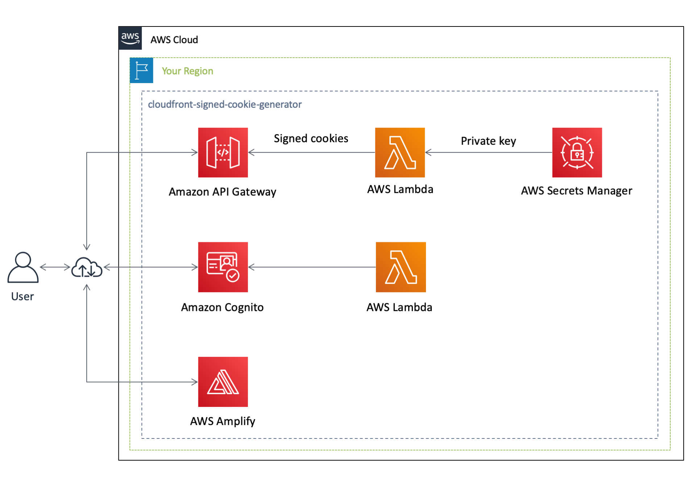

[**English**](README.md) / 日本語

# cloudfront-signed-cookie-generator

 

``cloudfront-signed-cookie-generator`` は、Amazon CloudFront 上のWEBサイトへアクセスするための署名付きCookieを生成する、AWS Amplify アプリケーションです。このアプリケーションは、Vue.js で記述されており、Amazon API Gateway, Amazon Cognito, AWS Lambda and AWS Secret Manager および Amplify CLI が使用されています。

## アーキテクチャ



```
$ amplify status

| Category | Resource name         | Operation | Provider plugin   |
| -------- | --------------------- | --------- | ----------------- |
| Function | getcookie             | No Change | awscloudformation |
| Function | signedcookiePreSignup | No Change | awscloudformation |
| Auth     | signedcookie          | No Change | awscloudformation |
| Api      | getcookie             | No Change | awscloudformation |
| Secret   | signedcookie          | No Change | awscloudformation |
```

``Secret`` カテゴリは、 このアプリケーション独自のカスタムリソースです。

## AWS Amplify Console を用いたデプロイ

AWS Amplify Console は、フルスタックサーバレスアプリケーションをホスティングします。AWSアカウントにサインインした上で下のボタンをクリックし、このアプリケーションをデプロイしてください。

[](https://console.aws.amazon.com/amplify/home#/deploy?repo=https://github.com/eijikominami/cloudfront-signed-cookie-generator-generator)

AWS Amplify Console は、このリポジトリをあなたの GitHub アカウント上にフォークします。その後、バックエンドとフロントエンドのビルドとデプロイを実行します。生成されたアプリケーションは、 ``https://master.appid.amplifyapp.com`` で利用可能となります。

## 設定

デプロイ完了後、以下の設定を行なってください。

### CloudFront キーペアの作成

CloudFront 署名付きCookieを利用するためには、CloudFront キーペアが必要です。 [キーペアを生成](https://docs.aws.amazon.com/AmazonCloudFront/latest/DeveloperGuide/private-content-trusted-signers.html#private-content-creating-cloudfront-key-pairs) して、AWS Security Manager に秘密鍵を保存してください。

### カスタムポリシーの設定

このアプリケーションは、[カスタムポリシー](https://docs.aws.amazon.com/ja_jp/AmazonCloudFront/latest/DeveloperGuide/private-content-setting-signed-cookie-custom-policy.html)を用いた署名付きCookieを生成します。カスタムポリシーは、JSON形式で、署名付きCookieの認証条件を明記しています。自身の環境に合わせて ``amplify/backend/function/getcookie/parameters.json`` を更新してください。

```json:amplify/backend/function/getcookie/parameters.json
{
    "AccessKey": "XXXXXXXXXXXXXXXX",
    "Domain": "example.com",
    "Duration": 3600,
    "IpAddress": "0.0.0.0/0",
    "ResourcePath": "http://example.com/*"
}
```

以下のパラメータを指定することができます。

| 名前 | タイプ | 詳細 |
| --- | --- | --- |
| AccessKey | String | キーペアID |
| Domain | String | リクエストするファイルのドメイン名 |
| Duration | String | リクエスト時刻を起点とした署名付きCookieの有効期限 |
| IpAddress | String | 許可するIPアドレス  |
| ResourcePath | String | 許可するリクエストパス |